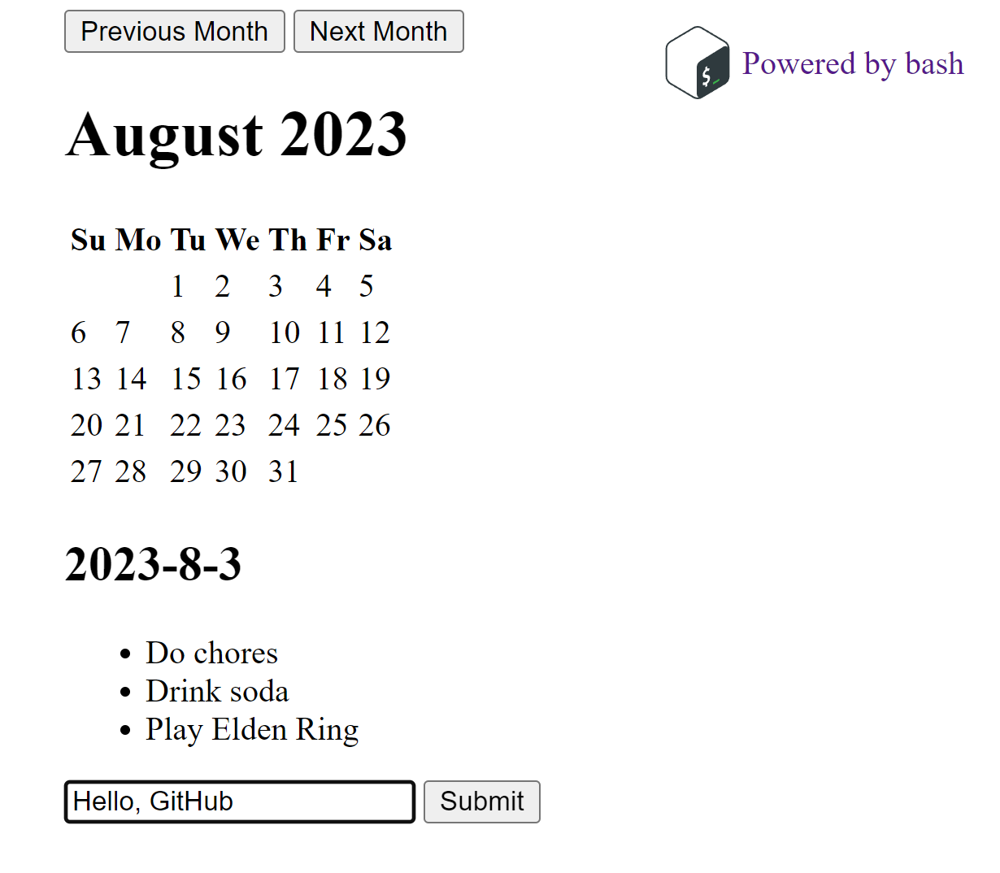

# BashCal

This is a small application written using [The Bash Stack](https://bashsta.cc/) with help from [@cgsdev0](https://github.com/cgsdev0).

It features:

- BASH server
- HTMX
- Live sync of calendar events using SSE
- Selecting dates with stored todo lists

## Usage

Assuming you're using Ubuntu:

- `sudo apt install ucspi-tcp`
- `bash ./start.sh`

## Notes

> This project needs some major work in regards to accessibility.

> It's also worth mentioning that this project is mostly a joke to see how far we could push BASH programming in 2 hours.